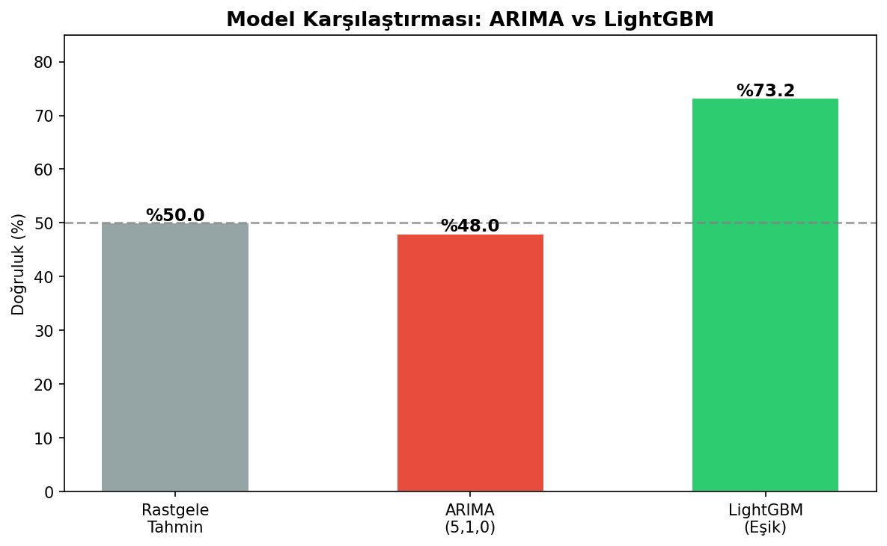
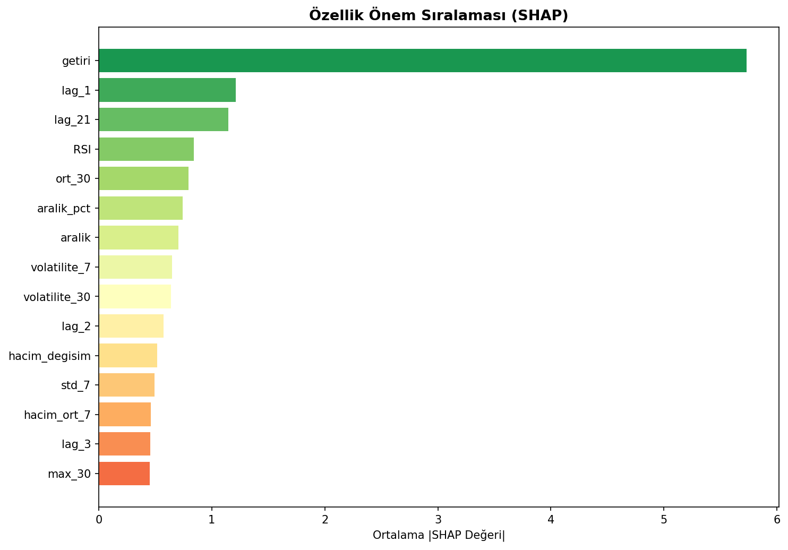

# Bitcoin Yön Tahmini

Model, 2020'den bugüne kadar olan Bitcoin verisiyle eğitildi. Seçilen tarihe göre bir sonraki günün yönünü tahmin ediyor.

## Canlı Uygulama
👉 [bitcoin-yon-tahmini.streamlit.app](https://bitcoin-yon-tahmini.streamlit.app)

## Nasıl Çalışır?
Tahmin için %1 eşik değeri kullanılıyor — fiyat %1'den fazla artarsa yükseliş, %1'den fazla düşerse düşüş olarak değerlendiriliyor.

| Sonuç | Açıklama |
|-------|----------|
| Yükseliş | Ertesi gün fiyat %1'den fazla arttı |
| Düşüş | Ertesi gün fiyat %1'den fazla azaldı |
| Yatay | Fiyat ±%1 aralığında kaldı |

## Model Sonuçları

| Model | Doğruluk |
|-------|----------|
| Rastgele Tahmin | %50.0 |
| ARIMA(5,1,0) | %49.9 |
| LightGBM (ham) | %68.1 |
| LightGBM (eşik) | **%77.6** |

## Özellikler
- 30+ özellik: lag değerleri, RSI, volatilite, hacim
- SHAP ile açıklanabilirlik
- Her tahminle birlikte fiyat grafiği

## Teknolojiler
`Python` `LightGBM` `SHAP` `Streamlit` `yfinance` `pandas` `matplotlib`
## Görseller

### Model Karşılaştırması

### SHAP Özellik Önemi

## Geliştirici
[LinkedIn](https://www.linkedin.com/in/mehmet-ali-bekmez-866b7a294/)
